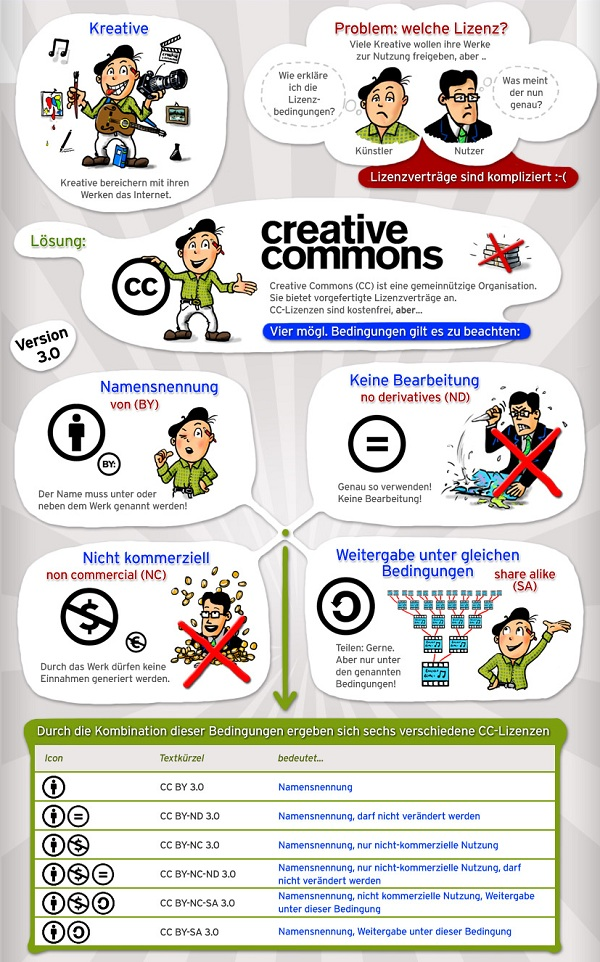

## Lizenzen

### Bilder

Hintergrund: Welche Bilder können wir benutzen, ohne rechtliche Schwierigkeiten zu bekommen?

#### Gemeinfrei / "Public domain"

Gemeinfrei oder "public domain" werden Werke genannt, an denen keine Urheberrechte bestehen. Das gilt in Deutschland entweder 70 Jahre nach dem Tod des Urhebers (bei einfachen Schnappschüssen 50 Jahre). Ein solches Bild kennzeichnet man mit dem Link <a href="https://www.gesetze-im-internet.de/urhg/__64.html">>> gemeinfrei nach UrhG §64</a>. 

Urheber z. B. in den USA können auf ihr Urheberrecht komplett verzichten. Das Werk wird demnach zur "Public Domain" und kann ohne Einschränkungen verwendet oder verändert werden. Die zugehörige Lizenz wird als "CC0 1.0 Universal - Public Domain Dedication", kurz CC0 1.0, bezeichnet.
Ein solches Bild erkennt man an der folgenden Kennzeichnung:  
  
Wenn man diese Bilder verwendet, muss man keine Quelle angeben.

#### Freie Lizenzen

In Deutschland kann man auf sein Urheberrecht nicht verzichten. Allerdings können der Allgemeinheit Nutzungsrechte eingeräumt werden.

Bei diesen sogenannten freien Lizenzen kann der Urheber selbst festlegen unter welchen Bestimmungen das Werk weiter genutzt werden darf. Dabei werden meist die Creative-Commons-Lizenzen verwendet, die aus standardisierten Lizenzbausteinen bestehen. Die Bilder können dann ohne Nachfrage benutzt werden, solange sich an die Bedingungen gehalten wird.

Auf dieser Grafik sind die wichtigsten Attribute zusammengefasst:

  
<a href=https://www.bildersuche.org/creative-commons-infografik.php>Creative Commons – Was ist und bedeutet das?</a> von Martin Mißfeldt auf <a href=https://www.bildersuche.org>Bildersuche.org</a> lizenziert unter <a href="https://creativecommons.org/licenses/by-sa/3.0/de/">CC BY-SA 3.0 DE</a>

Wie man bei dieser Abbildung schon sehen kann, sollten folgende Angaben gemacht werden:

* den Titel des Bildes, welcher als Link zum Bild fungiert (wenn kein Titel angegeben, nur Quelle mit Link)
* den Autor bzw. Urheber des Bildes
* die Quelle des Bildes, welche als Link zur Webseite fungiert, auf der man das Bild gefunden hat
* Bearbeitungshinweise (z.B. Zuschneiden des Bildes), falls Bild verändert wurde
* die Lizenz, unter der das Bild veröffentlicht wurde, welcher als Link zur Lizenzinformation fungiert

Außerdem kann es sinnvoll sein, das Zugriffsdatum mit anzugeben.

### Eigene Fotografien

Bilder, die man selbst geschossen oder anderweitig erstellt hat, darf man immer verwenden. Mit einer Ausnahme: Es herrscht ein "Recht am eigenen Bild". Das heißt, dass jede Person grundsätzlich selbst entscheiden darf, ob sie fotografiert werden möchte und wozu diese erstellten Fotografien benutzt werden dürfen. Das bedeutet, man muss die Person ausdrücklich um Erlaubnis bitten.

### Anlaufstellen

1. <a href="https://commons.wikimedia.org/wiki/Hauptseite">Wikimedia Commons</a>

    Hier findet man zum Großteil Creative Commons Lizenzen oder gemeinfreie Bilder.
    Außerdem gibt es den <a href="https://lizenzhinweisgenerator.de/">lizenzhinweisgenerator.de</a>, welcher einem die passende Kennzeichnung zum verwendeten Bild erstellt.

2. <a href="https://de.wikipedia.org/wiki/Wikipedia:Public-Domain-Bilderquellen">Wikipedia: Public-Domain-Bilderquellen</a>

    Hier findet man eine Liste, welche Public Domain Bildergalerien zu bestimmten Themen aufzählt.

3. <a href="https://flickr.com/search/advanced/">Flickr</a>
    
    Flickr ist eine Fotocommunity, welche Milliarden von Fotos bereitstellt. Hier kann man bei der Fotosuche filtern nach 'keine bekannten Urheberrechtseinschränkungen' oder nach 'kommerzielle Nutzung und Änderungen erlaubt'.  
    
4. <a href="https://www.flickr.com/commons/usage/">Flickr - Die Commons</a>

    Flikr hat auch eine eigene Rubrik Commons, wo Bilder gesammelt werden, bei denen keine Urheberrechte mehr bestehen. Sie stammen vor allem von Museen, Archiven und weiteren Organisationen z.B. der British Library oder der NASA.
    
5. <a href="https://search.creativecommons.org/">CC Search</a>

    CC Search ist eine Suchmaschine von Creative Commons. Hier kann man nach CC-lizenzierten Bildern im Netz suchen, wobei ungefähr 20 verschiedene Anbieter abgefragt werden, darunter auch Flickr. Die Dateien lassen sich mitsamt Lizenzhinweisen herunterladen.
    
#### Quellen

https://www.cyon.ch/blog/Bilder-im-Internet-rechtssicher-verwenden  
https://irights.info/artikel/nicht-nur-kostenlos-sondern-frei-zehn-anlaufstellen-fuer-bilder-im-netz/22457
https://www.mebis.bayern.de/infoportal/tutorials/weitere/teachshare/quellenangaben-best-practice/
https://www.bildersuche.org/creative-commons-infografik.php
https://lehrerfortbildung-bw.de/st_digital/medienwerkstatt/internet/freemedia/definition/lizenzen/
https://www.lecturio.de/magazin/creative-commons-blogger/

    